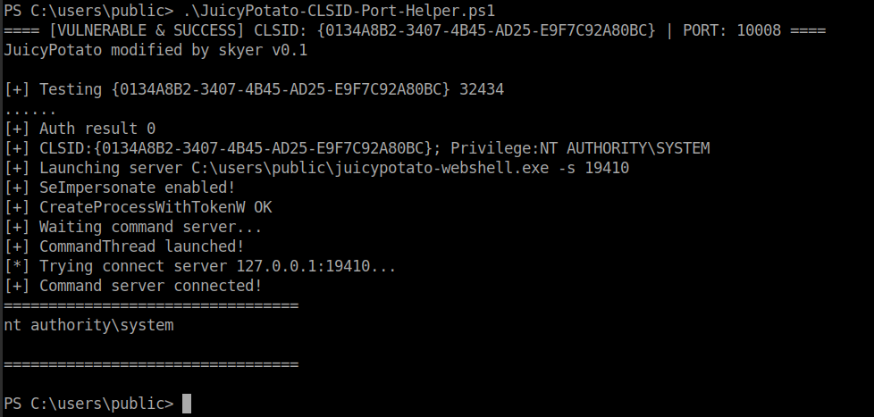

# JuicyPotato CLSID & Port Helper

A PowerShell helper that combines CLSID enumeration and JuicyPotato testing into a single script.

Designed to simplify repetitive CLSID and port testing during authorized Windows privilege escalation assessments.

## Features

* Automatically enumerates registered CLSIDs
* Generates a fresh `CLSID.list`
* Tests CLSIDs sequentially
* Automatically increments the testing port after failed attempts
* Creates a fresh `result.log` for each run
* Detects successful `NT AUTHORITY\SYSTEM` execution
* Filters common connection and execution errors
* Stops testing after a successful result is detected

## Requirements

* Windows
* PowerShell
* `juicypotato-webshell.exe`

## Usage

Place the required files under:

```text id="p7q3wm"
C:\Users\Public\
├── JuicyPotato-CLSID-Port-Helper.ps1
└── juicypotato-webshell.exe
```

Run:

```powershell id="f7z8xe"
.\JuicyPotato-CLSID-Port-Helper.ps1
```

The script will automatically:

1. Enumerate CLSIDs from `HKEY_CLASSES_ROOT`
2. Generate `CLSID.list`
3. Test the available CLSIDs
4. Increment the testing port after failed attempts
5. Detect successful SYSTEM execution
6. Stop when a successful result is found

## Output

The script generates:

```text id="c5o4pq"
C:\Users\Public\CLSID.list
C:\Users\Public\result.log
```

Example successful output:

```text id="e0t7sy"
========== RESULT ==========
==== [VULNERABLE & SUCCESS] CLSID: {CLSID} | PORT: 10025 ====
...
============================
```
## Example

The following screenshot shows the tool successfully identifying a working CLSID and port combination.



## Background

The original workflow used separate scripts for CLSID enumeration and JuicyPotato testing.

This project combines that workflow into a single PowerShell script and adds:

* Automated CLSID enumeration
* Integrated testing
* Fresh log handling
* SYSTEM success detection
* Error filtering
* Automatic termination after success

## Credits

This project is based on scripts and techniques shared by **J0o1ey** in the following CNBlogs article:

* [J0o1ey - CNBlogs Article](https://www.cnblogs.com/J0o1ey/p/15714555.html)

The original article provides CLSID enumeration and batch JuicyPotato testing techniques, including automatic port incrementation.

This project combines and modifies that workflow into a single PowerShell helper.

Original authorship and credit for the referenced scripts and techniques belong to their respective authors.

## References

* [JuicyPotato](https://github.com/ohpe/juicy-potato)
* [J0o1ey - CNBlogs Article](https://www.cnblogs.com/J0o1ey/p/15714555.html)
* [3gstudent](https://3gstudent.github.io/)

## Disclaimer

This tool is provided for authorized penetration testing, security research, and educational purposes only.

Do not use this tool against systems without explicit authorization.

